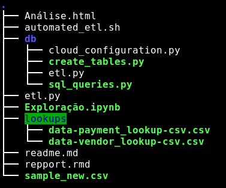

# Data Sprints

Esse projeto ocorreu como parte de um processo para uma vaga de Engenharia de dados da empresa Data Sprints.

O projeto tem como objetivo a realização de uma Análise Exploratória dos Dados das viagens de taxi que ocorrem em Nova York. Identificando informações chave como:
- Faturamento total das empresas de taxi no período
- Tempo médio das corridas realizadas no sábado eno domingo
- Distribuição do número de corridas por mês

Como era uma base de dados relativamente média (4GB), optei pela utilização de um banco de dados na AWS Redshift para armazenar os dados.

## Replicando o processo na sua máquina

As instruções abaixo possibilitarão a replicação de todo o código utilizado.


### Pré-requisitos

Processo de ETL:
- Python 3.5+: boto3, pandas, numpy, psycopg2
- Uma conta ativa na AWS com um usuário administrador (utilização da KEY e da SECRET para automatização do processo de criação do cluster)
- Linux

Análise.html:
- Python 3.5+: pandas, psycopg2
- R: Reticulate (integração com R), ggplot2, dplyr, maps, maptools, gganimate, tidyquant, rmarkdown

Exploração.ipynb: 
- Python 3.5+: Pandas, Numpy, Seaborn, Matplotlib, psycopg2 e jupyter
- PostgreSQL


### Installing

A step by step series of examples that tell you how to get a development env running

Say what the step will be

```python
pip install psycopg2 pandas numpy seaborn matplotlib boto3 jupyter
```

**PostgreSQL** : https://www.postgresql.org/download/


**R**
```
### Rbase
apt-get install r-base curl
apt-get -y install libcurl4-gnutls-dev

##### Rstudio
wget https://download1.rstudio.org/desktop/debian9/x86_64/rstudio-1.2.1335-amd64.deb
dpkg -i $HOME/Downloads/rstudio-1.2.1335-amd64.deb
apt-get install -f


# Dentro do console do Rstudio
install.packages('devtools')
install.packages('tidyverse') # tidyverse combina diversas bibliotecas em uma só.
install.packages('gganimate')
install.packages('tidyquant')
install.packages('maps')
install.packages('maptools')
```

[Criando usuário administrador na Amazon](https://docs.aws.amazon.com/mediapackage/latest/ug/setting-up-create-iam-user.html)


## Estruturação do projeto

#### Treeview:
</img>

Para executar o processo de ETL. Utilize o seguinte comando no terminal:
```
bash automated_etl.sh
```

Esse comando irá executar os arquivos na seguinte ordem:
```
cloud_configuration.py >> create_tables.py >> etl.py
```

O primeiro arquivo irá te perguntar os valores da sua key e secret da amazon e, com esses dados, irá criar um Cluster na Amazon Redshift e também irá criar um `IAM Role` com autorização para baixar dados da S3.

Esse processo é importante porque facilita muito o processo de ETL, principalmente, porque é possível extrair os dados diretamente do Bucket que eu criei `s3://data-sprints-test` e realizar a ingestão desses dados no Cluster que será criado.

Com o intuito de limitar um pouco os gastos, optei pela configuração de um cluster com apenas um Node, no entanto, isso pode ser alterado fácilmente dentro do arquivo `cloud_configuration.py`.

O processo de criação do cluster e realização do ETL dura em torno de 8 minutos, variando conforme a capacidade de processamento do clusters.

**Importante**: Ao interromper o cluster, nunca se esquela de deletá-lo para não incorrer em custos extras.

Após a realização do ETL, o arquivo repport.rmd já está linkado com o cluster.


